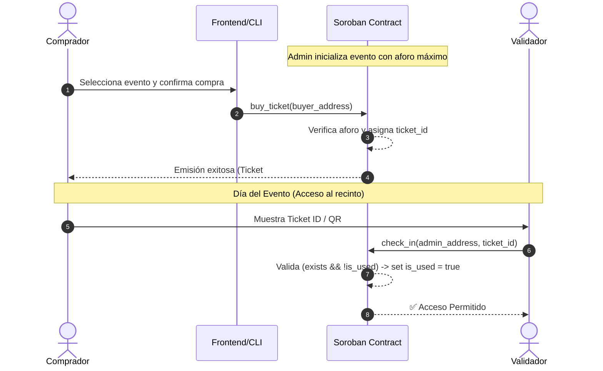

# 🎟️ CulturaGo Stellar Ticket - Arquitectura del Sistema

**CulturaGo Stellar Ticket** es una plataforma descentralizada de ticketing para eventos culturales (teatro, conciertos, museos, festivales) construida sobre la red **Stellar** utilizando smart contracts con **Soroban**.

---

## 📐 1. Objetivos del Sistema

* **Autenticidad y Prevención de Falsificaciones:** Cada ticket es emitido de manera inmutable y verificable en la blockchain de Stellar.
* **Control de Aforo Estricto:** Evitar sobreventa mediante límites programáticos en el smart contract.
* **Validación en Puerta (Check-in):** Mecanismo criptográfico y seguro para marcar tickets como utilizados en un solo paso (`check_in`).
* **Trazabilidad y Transferencia Segura:** Registro transparente de la propiedad y precio de compra de cada entrada.

---

## 🏛️ 2. Modelos de Datos (Soroban Rust)

### 2.1. Estado Global del Evento (`EventConfig`)
```rust
pub struct EventConfig {
    pub admin: Address,         // Organizador del evento
    pub event_name: Symbol,     // Nombre del evento cultural
    pub ticket_price: i128,     // Precio en stroops (XLM)
    pub total_capacity: u32,    // Aforo máximo
    pub tickets_sold: u32,      // Entradas vendidas
    pub is_active: bool,        // Estado del evento (activo/cerrado)
}
```

### 2.2. Modelo del Ticket Individual (`Ticket`)
```rust
pub struct Ticket {
    pub id: u32,                // ID único correlativo
    pub owner: Address,         // Billetera Stellar del titular
    pub price_paid: i128,       // Monto pagado
    pub is_used: bool,          // true si ya fue validado en puerta
    pub timestamp: u64,         // Fecha/hora de compra (timestamp ledger)
}
```

---

## ⚙️ 3. Funciones del Smart Contract (`TicketContract`)

| Función | Parámetros | Rol Requerido | Descripción |
| :--- | :--- | :--- | :--- |
| `initialize` | `admin`, `event_name`, `price`, `capacity` | Público (una sola vez) | Configura el evento y aforo inicial. |
| `buy_ticket` | `buyer: Address` | Comprador | Valida pago y aforo, emite un nuevo `Ticket` a nombre del comprador. |
| `check_in` | `admin: Address`, `ticket_id: u32` | Administrador / Validador | Valida que el ticket exista y no haya sido usado, luego lo marca como `is_used = true`. |
| `get_ticket` | `ticket_id: u32` | Público | Retorna los detalles de un ticket. |
| `get_event_info` | Ninguno | Público | Retorna métricas generales (aforo restante, total vendido). |

---

## 🔄 4. Flujo de Vida del Ticket



---

## 🛡️ 5. Consideraciones de Seguridad
1. **Autenticación en Check-in:** Solo el organizador (`admin`) o una cuenta autorizada puede ejecutar `check_in`.
2. **Prevención de Reentrancy / Doble Entrada:** Actualización inmediata del flag `is_used` antes de emitir cualquier evento.
3. **Control de Desbordamiento de Aforo:** Condición estricta `tickets_sold < total_capacity` previo a cualquier emisión.
